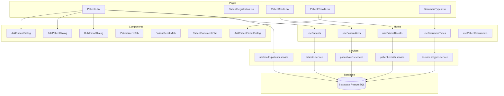
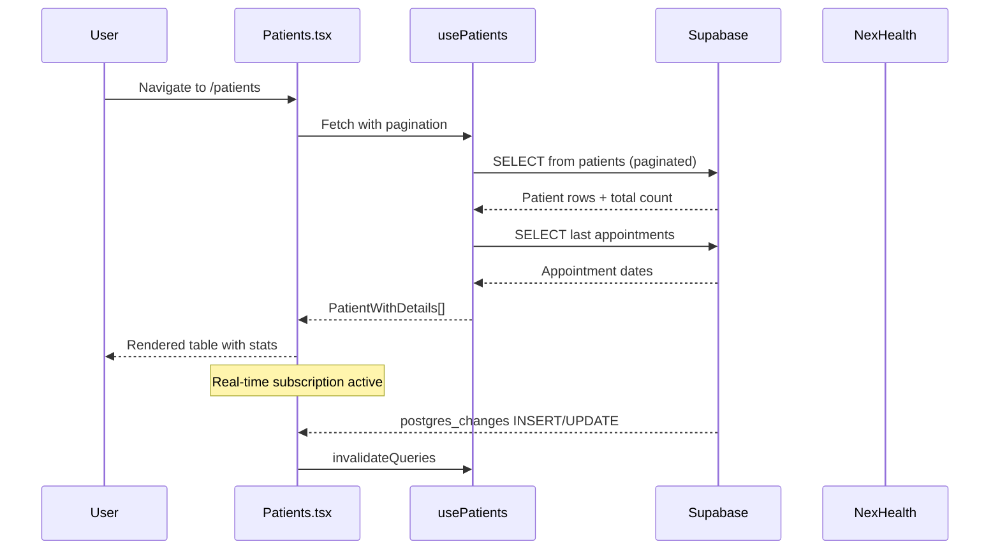
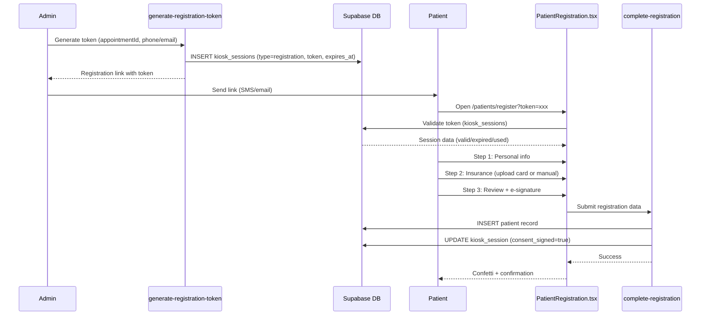
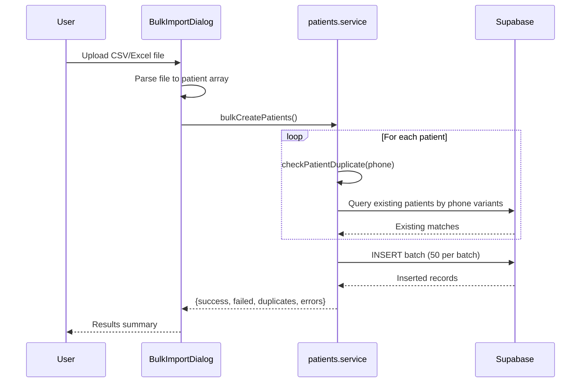

# Patient Management - Architecture

## Overview

The Patient Management module follows the project's layered architecture: pages delegate to React Query hooks, which wrap service functions that perform all Supabase data access. NexHealth synchronization runs as a parallel data pipeline, with merged/deduplicated results presented to the UI.

## Component Architecture

## Data Flow

### Patient List Flow

### Self-Registration Flow

### Bulk Import Flow

## Key Design Decisions

1. **Database-first with NexHealth as background sync**: Patients are always read from the local `patients` table. NexHealth sync populates this table but does not serve as the primary data source.

2. **Dual delete strategy**: NexHealth-synced patients receive soft delete (`is_active=false`, `nexhealth_sync_status='removed'`), while platform-created patients can be hard deleted.

3. **Phone-based duplicate detection**: Bulk import normalizes phone numbers and checks multiple format variants before inserting.

4. **HIPAA audit logging**: Patient record views and modifications are logged via fire-and-forget calls to `hipaa-audit.service.ts`.

5. **Real-time updates**: The Patients page subscribes to Supabase Realtime for `INSERT` and `UPDATE` events on the `patients` table, automatically refreshing the list when new patients register.

## State Management

- **React Query**: All server state (patient lists, alerts, recalls, document types) is managed via React Query with cache invalidation on mutations.
- **Local state**: UI state (selected patient, dialogs open/closed, pagination, search filter) is managed via `useState` within page components.
- **Zustand**: Not directly used by this module, though `selectedPatientId` from the global store may be consumed by other modules.

## Error Handling

- Services throw errors on failure; pages catch them and display via `sonner` toast notifications.
- The Patients page renders a dedicated error state with a retry button when the initial query fails.
- Bulk operations return partial success/failure counts instead of failing entirely.
